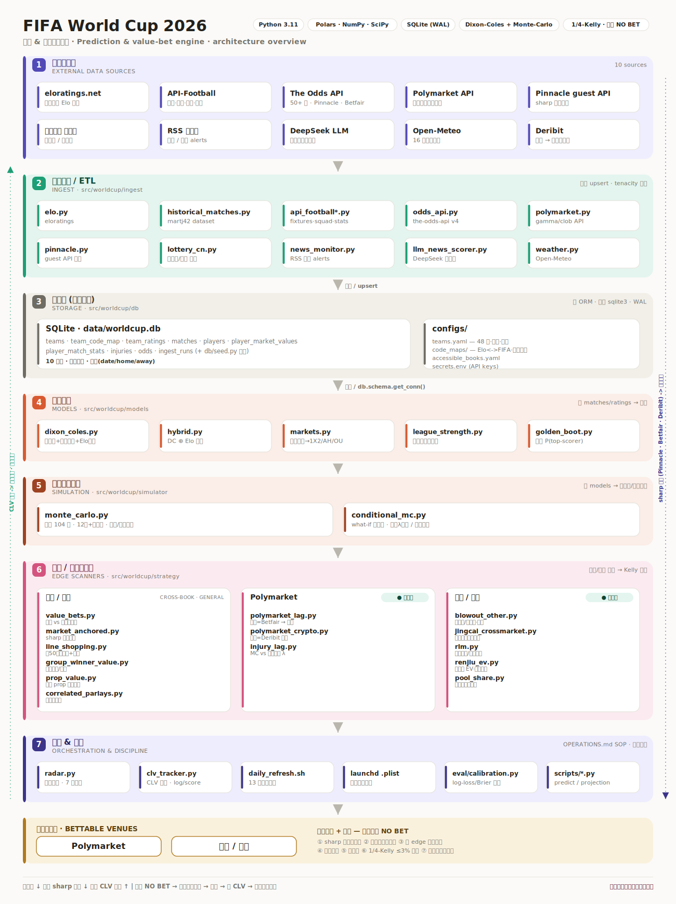

# ⚽ World Cup 2026 Watching Companion / 世界杯 2026 看球伴侣

A daily-digest engine for the 2026 World Cup that lands in your Telegram every evening — tactical matchup briefs, score "sniffs", injury/news radar, weather lenses, and last-round qualification incentives — built **enjoyment-first**, with quant honesty.

每天晚上推送到 Telegram 的世界杯每日简报引擎:战术博弈推演、比分嗅觉、伤病/新闻雷达、天气视角、末轮出线利益探测。定位是**娱乐优先**的看球伴侣,但保持量化层面的诚实。



## What it does / 它做什么

Every evening (23:00 by default) a launchd job runs the full pipeline and pushes a Chinese-language digest:

- **Tactical 推演 (scout layer)** — LLM-generated team profiles + matchup briefs (formation clash, game script, key battles, swing factors), anchored to real data: Elo, recent form, *verified* current absences, venue weather. Player names are whitelist-constrained so the LLM can't invent people.
- **Three-way total-goals check** — de-vigged market O/U line (the sharpest baseline) vs a Dixon-Coles model vs the tactical lean. Divergence (⚑) is a talking point, not an auto-edge — the digest says so.
- **Score sniff / 比分嗅觉** — top-3 most likely scorelines from the DC score matrix, *with probabilities*, so you can see even the best guess is a ~1-in-8 shot.
- **MD3 incentive detector / 末轮出线利益** — the 2026 48-team format makes last-round incentives weird (mutual draws, dead rubbers, must-win shootouts). Exact 9-outcome enumeration per group, mapped to total-goals leans.
- **News/injury radar** — RSS + structured API injuries, LLM-scored for severity, with a freshness window and recovery-news cancellation (a November red card is not a June absence).
- **Honest data watermark** — every digest stamps when odds and 推演 were last refreshed; stale data gets a loud ⚠.

核心设计原则:**每个判断都要有真凭据**(引用得出锚定数据才许表态)、**市场通常比你聪明**(⚑分歧默认是看点而非 edge)、**数据几岁要标清楚**。

## Stack

Python · SQLite · Dixon-Coles (1997) with Elo-anchored ridge prior & friendly down-weighting · Monte Carlo tournament sim · DeepSeek (LLM briefs & news scoring) · The Odds API / API-Football / Open-Meteo / Polymarket · Telegram Bot API.

## Quickstart

```bash
git clone <this repo> && cd worldcup
python -m venv .venv && .venv/bin/pip install -e .        # or: uv sync

cp configs/secrets.example.env configs/secrets.env         # fill in your keys
# needs: ODDS_API_KEY, API_FOOTBALL_KEY, DEEPSEEK_API_KEY,
#        TELEGRAM_BOT_TOKEN + TELEGRAM_CHAT_ID (optional but the whole point)

.venv/bin/python scripts/init_db.py                        # create + seed SQLite
bash scripts/daily_refresh.sh                              # full pipeline + digest + push
```

One-off tools / 单独使用:

```bash
PYTHONPATH=src .venv/bin/python -m worldcup.strategy.scout --brief GER CUW   # one matchup brief
PYTHONPATH=src .venv/bin/python -m worldcup.strategy.group_incentives        # MD3 incentive board
PYTHONPATH=src .venv/bin/python -m worldcup.models.dixon_coles               # model sanity report
```

### Daily automation (macOS launchd)

```bash
sed "s|/path/to/worldcup|$(pwd)|g" scripts/com.worldcup.dailyrefresh.plist \
  > ~/Library/LaunchAgents/com.worldcup.dailyrefresh.plist
launchctl bootstrap gui/$(id -u) ~/Library/LaunchAgents/com.worldcup.dailyrefresh.plist
```

Telegram setup: create a bot via `@BotFather`, put the token in `configs/secrets.env`, message the bot once, then `python -m worldcup.notify.telegram --get-chat-id`.

## Design notes / 设计笔记

[TUIYAN_AUDIT_20260610.md](TUIYAN_AUDIT_20260610.md) is a frank pre-tournament audit of this system (26 verified findings) and the improvement roadmap — useful if you want to understand the failure modes of LLM-generated sports analysis (template collapse, stale-cache staleness, fact-supply gaps) and how this repo counters them.

这份开赛前夜的完整审计记录了 LLM 体育推演的典型失效模式(套话坍缩/缓存陈旧/事实供给断档)和对应的工程对策,是本仓库最值得读的文档。

## Disclaimer / 免责声明

This is a **watching companion for entertainment and research**, not betting advice. Its own backtests refuted the main-line edges it once hoped for — the honest conclusion baked into the design is: *the closing line beats you; bet small for fun or not at all.* If you gamble, know your local laws, set a hard cap, and never chase losses.

本项目是**娱乐与研究用途**的看球伴侣,不构成任何投注建议。它自己的回测否定了主盘 edge 的存在——设计里写死的诚实结论是:打不过收盘线,小注图个乐,或者干脆不下。请遵守当地法律,设硬上限,绝不追损。

## License

MIT © 2026 tupils1
